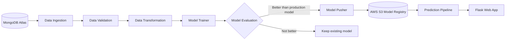
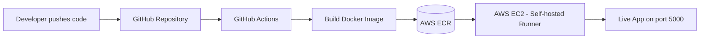

<div align="center">

# 🚗 Vehicle Data — End-to-End MLOps Project

### From raw data in MongoDB to a live ML app on AWS, fully automated with CI/CD


**Predicts whether a customer will buy vehicle insurance, powered by a production-style, modular, containerized and fully automated ML pipeline.**

[Demo](#-live-dashboard) • [Architecture](#-architecture) • [Pipeline](#-ml-pipeline-components) • [Tech Stack](#-tech-stack) • [Setup](#-getting-started) • [CI/CD](#-cicd--deployment) • [Usage](#-usage)

</div>

---

## 📌 Overview

**The business problem:** an insurance company wants to know which customers are likely to be interested in vehicle insurance, so the sales team can focus on the right people. This app takes an 11-feature customer profile and returns an instant **Yes / No** decision from the trained model.

This project goes beyond a notebook model. It is a **complete MLOps workflow** that covers every stage of the machine learning lifecycle:

- 🗄️ Data is stored in and pulled from **MongoDB Atlas**
- 🧩 The training workflow is split into **independent, reusable pipeline components**
- ☁️ Trained models are versioned and stored in an **AWS S3 model registry**
- 🐳 The app is **containerized with Docker** and stored in **AWS ECR**
- 🚀 Every `git push` **automatically builds and deploys** the app to **AWS EC2** through a **GitHub Actions self-hosted runner**
- 🌐 A **Flask web app** serves predictions and can trigger model training on demand

---

## 🖥️ Live Dashboard

<div align="center">


*The deployed app on AWS EC2: enter a customer profile, hit **Predict interest** for an instant decision, or **Train model** to retrain the pipeline.*

</div>

### Input features (11 signals)

| Feature | Description |
|---------|-------------|
| Gender | 1 = Male, 0 = Female |
| Age | Customer age in years |
| Driving License | 0 = No, 1 = Yes |
| Region Code | Numeric region ID |
| Previously Insured | 0 = No, 1 = Yes |
| Annual Premium | Quoted premium amount |
| Policy Sales Channel | Channel code |
| Vintage | Days the customer has been with the company |
| Vehicle Age < 1 Year | 0 = No, 1 = Yes |
| Vehicle Age > 2 Years | 0 = No, 1 = Yes |
| Vehicle Damage | 0 = No, 1 = Yes |

**Output:** `Response-Yes` (likely to buy) or `Response-No` (unlikely to buy).

---

## ✨ Key Highlights

| | Feature | What it demonstrates |
|---|---|---|
| 🏗️ | **Modular architecture** | Config → Entity → Component → Pipeline design, clean separation of concerns |
| 🛡️ | **Data validation** | Schema-driven checks (`schema.yaml`) before any training happens |
| 🔁 | **Model evaluation gate** | A new model is only pushed if it beats the current one by a defined threshold |
| 📦 | **Model registry on S3** | Versioned model storage and retrieval with `boto3` |
| 🪵 | **Custom logging and exceptions** | Easy debugging and traceable pipeline runs |
| ⚙️ | **Full CI/CD** | Commit → Docker build → ECR → EC2 deploy, with zero manual steps |

---

## 🧭 Architecture



### Deployment flow



---

## 🧩 ML Pipeline Components

| # | Component | Responsibility |
|---|-----------|----------------|
| 1 | **Data Ingestion** | Connects to MongoDB Atlas, fetches records in key-value format, converts them to a DataFrame and creates train/test splits |
| 2 | **Data Validation** | Validates the data against `schema.yaml` (columns, data types, structure) |
| 3 | **Data Transformation** | Feature engineering and preprocessing, saved as a reusable preprocessing object |
| 4 | **Model Trainer** | Trains the model and bundles preprocessing and model together in a single estimator |
| 5 | **Model Evaluation** | Compares the new model with the one in S3 using a threshold score (`0.02`) |
| 6 | **Model Pusher** | Pushes the accepted model to the S3 bucket (`model-registry`) |
| 7 | **Prediction Pipeline** | Loads the production model from S3 and serves predictions via the web app |

Each component follows the same pattern: **Config → Artifact → Component**, so the whole pipeline is easy to extend and test.

---

## 🛠️ Tech Stack

| Category | Tools |
|----------|-------|
| **Language** | Python 3.10 |
| **Database** | MongoDB Atlas (M0 cluster) |
| **ML and Data** | Pandas, NumPy, Scikit-learn |
| **Web Framework** | Flask |
| **Containerization** | Docker |
| **Cloud** | AWS S3, AWS ECR, AWS EC2 (Ubuntu), AWS IAM |
| **CI/CD** | GitHub Actions with a self-hosted runner |
| **Environment** | Conda / virtualenv |

---

## 📁 Project Structure

```text
├── .github/workflows/
│   └── aws.yaml                  # CI/CD pipeline
├── notebook/
│   ├── mongoDB_demo.ipynb        # Push data to MongoDB
│   └── EDA & Feature Engg.ipynb  # Exploration and feature engineering
├── src/
│   ├── components/               # Ingestion, Validation, Transformation, Trainer, Evaluation, Pusher
│   ├── configuration/            # MongoDB and AWS connections
│   ├── constants/                # Project-wide constants
│   ├── data_access/              # Fetch data from MongoDB as DataFrame
│   ├── entity/                   # Config, artifact and estimator classes
│   ├── aws_storage/              # S3 pull/push logic
│   ├── pipline/                  # Training and prediction pipelines
│   ├── logger/                   # Custom logger
│   ├── exception/                # Custom exception handling
│   └── utils/                    # Helper functions
├── config/
│   └── schema.yaml               # Dataset schema for validation
├── static/                       # CSS / JS assets
├── templates/                    # HTML templates
├── app.py                        # Flask application
├── demo.py                       # Pipeline runner
├── template.py                   # Project scaffolding script
├── Dockerfile
├── .dockerignore
├── requirements.txt
├── setup.py
└── pyproject.toml
```

---

## 🚀 Getting Started

### 1. Clone the repository

```bash
git clone <your-repo-url>
cd <your-repo-name>
```

### 2. Create and activate the environment

```bash
conda create -n vehicle python=3.10 -y
conda activate vehicle
pip install -r requirements.txt
```

> Run `pip list` to confirm the local packages are installed correctly (handled via `setup.py` and `pyproject.toml`).

### 3. Set up MongoDB Atlas

1. Create a free **M0** cluster on MongoDB Atlas
2. Create a database user
3. Under **Network Access**, add an IP address (`0.0.0.0/0` for development only)
4. Copy the Python driver connection string
5. Push the dataset using `notebook/mongoDB_demo.ipynb`

### 4. Configure environment variables

**Bash**
```bash
export MONGODB_URL="mongodb+srv://<username>:<password>@..."
export AWS_ACCESS_KEY_ID="<your-access-key>"
export AWS_SECRET_ACCESS_KEY="<your-secret-key>"
```

**PowerShell**
```powershell
$env:MONGODB_URL = "mongodb+srv://<username>:<password>@..."
$env:AWS_ACCESS_KEY_ID = "<your-access-key>"
$env:AWS_SECRET_ACCESS_KEY = "<your-secret-key>"
```

> 🔒 Never commit secrets. The `artifact/` directory is also listed in `.gitignore`.

### 5. Set up AWS S3 (model registry)

- Region: `us-east-1`
- Create the bucket: `my-model-mlopsproj`
- Make sure `constants/__init__.py` contains:

```python
MODEL_EVALUATION_CHANGED_THRESHOLD_SCORE: float = 0.02
MODEL_BUCKET_NAME = "my-model-mlopsproj"
MODEL_PUSHER_S3_KEY = "model-registry"
```

### 6. Run the training pipeline locally

```bash
python demo.py
```

### 7. Launch the web app

```bash
python app.py
```

---

## ☁️ CI/CD & Deployment

Every push to the repository triggers a fully automated pipeline:

```text
git push ──► GitHub Actions ──► Docker build ──► Push to AWS ECR ──► Pull and run on AWS EC2
```

### AWS resources used

| Service | Purpose |
|---------|---------|
| **IAM** | User with programmatic access for CLI and CI/CD |
| **ECR** | Private registry that stores the Docker image |
| **EC2** | Ubuntu 24.04 server that hosts the app (with Docker installed) |
| **S3** | Model registry |
| **Security Group** | Inbound rule opened for app port `5000` |

### GitHub secrets required

| Secret | Description |
|--------|-------------|
| `AWS_ACCESS_KEY_ID` | IAM access key |
| `AWS_SECRET_ACCESS_KEY` | IAM secret key |
| `AWS_DEFAULT_REGION` | `us-east-1` |
| `ECR_REPO` | ECR repository URI |

### EC2 setup in short

```bash
# Install Docker on the EC2 instance
curl -fsSL https://get.docker.com -o get-docker.sh
sudo sh get-docker.sh
sudo usermod -aG docker ubuntu
newgrp docker
```

Then register the instance as a **GitHub self-hosted runner** (*Settings → Actions → Runners → New self-hosted runner*) and start it with `./run.sh`. The runner should show as **Idle** on GitHub.

---

## 🌐 Usage

Once deployed, open:

```text
http://<EC2-PUBLIC-IP>:5000
```

| Route | Description |
|-------|-------------|
| `/` | Dashboard: enter the customer profile and click **Predict interest** to get the model decision |
| `/training` | Triggered by the **Train model** button: runs the full training pipeline on demand |

---

## 🔮 Future Improvements

- [ ] Add experiment tracking (MLflow / DVC)
- [ ] Add automated unit and integration tests to the CI stage
- [ ] Add model and data drift monitoring
- [ ] Apply least-privilege IAM policies and restrict network access
- [ ] Serve the app behind Nginx with HTTPS

---

## 🧠 What I Learned

- Designing a **production-grade, modular ML pipeline** instead of a single notebook
- Managing data with a **cloud NoSQL database** (MongoDB Atlas)
- Building a **model registry and evaluation gate** on AWS S3
- Containerizing ML apps with **Docker** and deploying to **EC2**
- Automating the whole lifecycle with **GitHub Actions CI/CD**

---

## 👤 Author

**Pradeep Prajapat**
